# TFM exploration

Below is an exploration of different project combinations to asses what it takes to add the net8.0-browser TFM and exercising the most common operations (restore, build, pack, publish)

* For testing I have only tried making the test project `net8.0-browser1.0`, referencing a `net8.0-browswer1.0` class library and calling dotnet test.

## General steps to enable the TFM

* Specify the platform with a version (haven't found a way to avoid the version)
* Add the property `<TargetPlatformSupported>true</TargetPlatformSupported>` to a property group.
* Add the version to the list of supported target platform versions:
  ```xml
  <ItemGroup Condition="'$([MSBuild]::GetTargetPlatformIdentifier($(TargetFramework)))' == 'browser'">
    <SdkSupportedTargetPlatformVersion Include="1.0" />
  </ItemGroup>
  ```

## List of scenarios with their description

### 01 - Standalone app
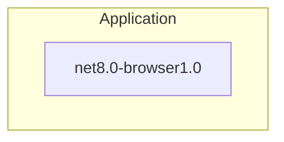

### 02 - Standalone class library
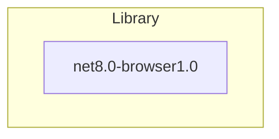

### 03 - Standalone multitargeting app
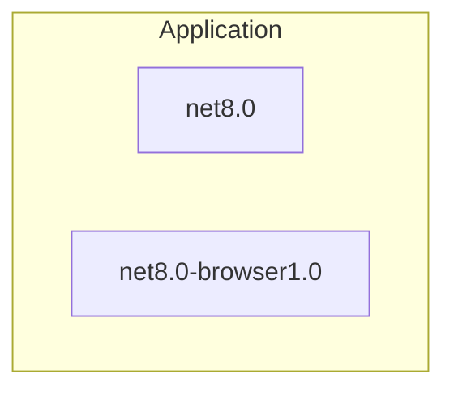

### 04 - Standalone multitargeting library
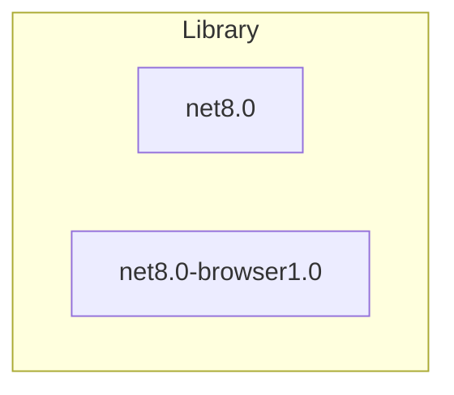

### 05 - Singletargeting app references singletargeting library
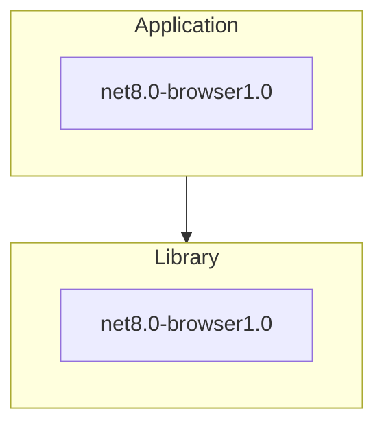

### 06 - Singletargeting app references singletargeting browser library
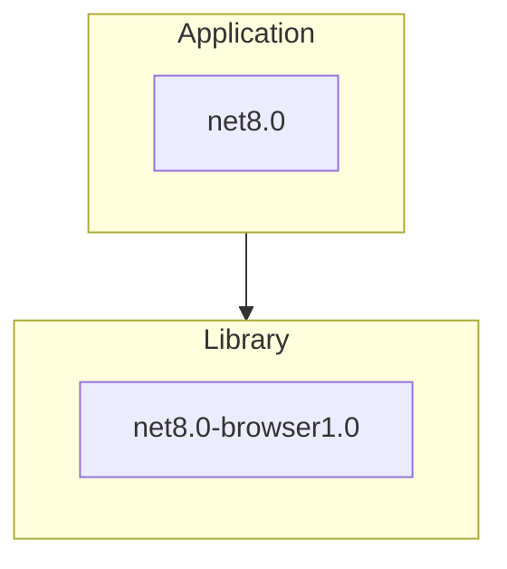

### 07 - Singletargeting browser app references singletargeting library
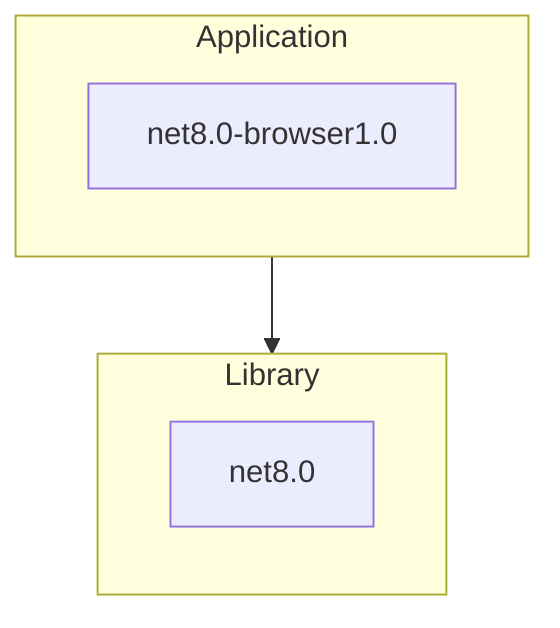

### 08 - Multitargeting app references multitargeting library
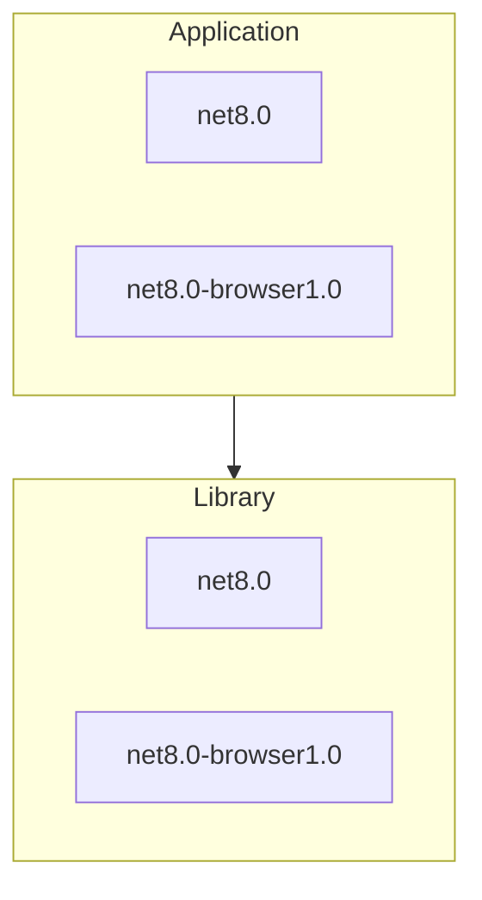

### 09 - Multitargeting app references single targeting library
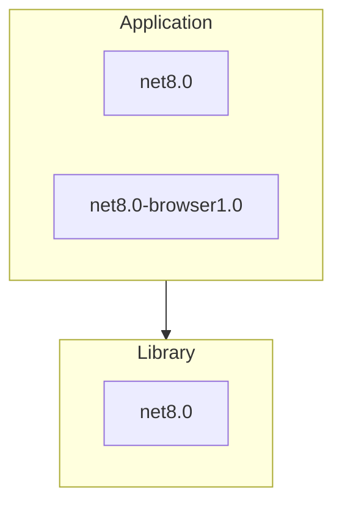

### 10 - Multitargeting app references single targeting library (browser)
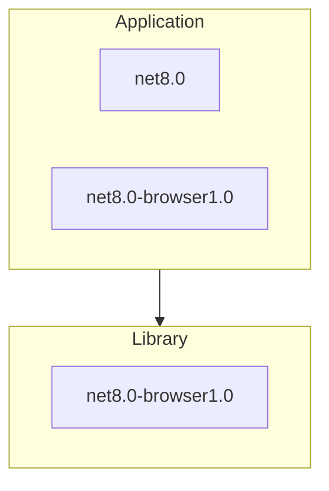

### 11 - Single targeting app references multi targeting library 
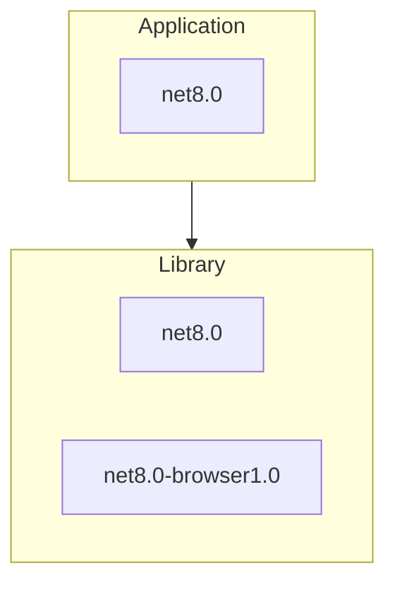

### 12 - Single targeting app references multi targeting library (browser)
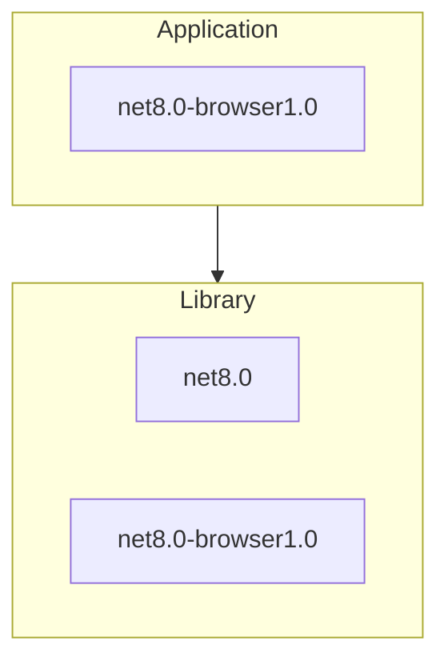

## Interesting scenarios

These are scenarios where I had to add additional attributes to the `ProjectReference` to get things working.

### Scenario 10

### 06 - Single target app references single targeting library (browser)

The app targets net8.0 and the library targets net8.0-browser


* Was able to make the project reference work by adding a couple of properties to it:
  ```xml
  <ProjectReference 
    Include="..\singletargetclasslib\singletargetclasslib.csproj"
    SkipGetTargetFrameworkProperties="true" 
    ReferenceOutputAssembly="false" />
  ```

* This effectively disabled referencing the output assembly but maintained the reference, so I suspect static web assets will work just fine in this scenario.

* The canonical example for this scenario is `Web App` "hosts" `Webassembly App`.

### 10 - Multitargeting app references single targeting library (browser)

App multitargets but the library only targets the browser


* Had to add the project reference to the library conditionally:
  ```xml
    <ItemGroup Condition="'$([MSBuild]::GetTargetPlatformIdentifier($(TargetFramework)))' == 'browser'">
      <ProjectReference Include="..\singletargetclasslib\singletargetclasslib.csproj" />
    </ItemGroup>
  ```
* Alternatively, could have done the same thing as in scenario 06 conditionally to the TFM being built not being the browser TFM.
